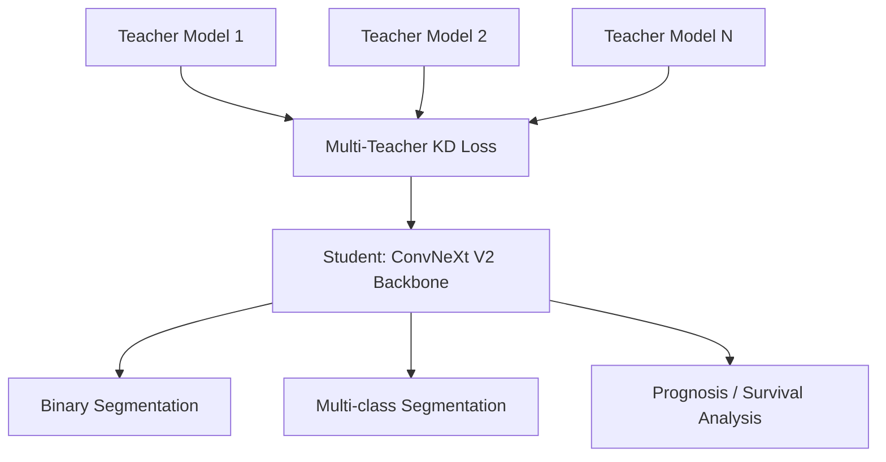

# Pandora

<div align="center">

**Pandora** — A Computational Pathology Foundation Model via Multi-Teacher Knowledge Distillation

[](https://www.python.org/)
[](https://pytorch.org/)
[](LICENSE)

</div>

---

## Overview

**Pandora** is a research repository for Computational Pathology (CPath), designed to learn universal pathological representations through multi-teacher knowledge distillation . The larned backbone can be directly applied to multiple downstream tasks.

---

## Model Architecture

Pandora uses **ConvNeXt V2** as the visual backbone, trained with a multi-teacher knowledge distillation strategy to distill complementary knowledge from multiple expert pathology models into a single unified encoder.



---


## Pretrained Weights

Pretrained model weights are available on 🤗 Hugging Face:

> **[`pandora` on Hugging Face Hub](https://huggingface.co/PUMCH-Liang-lab/pandora)**

| Model | Backbone | Parameters |                                        Download                                         |
| :---: | :---: | :---: |:---------------------------------------------------------------------------------------:|
| `Pandora-N` | ConvNeXt V2-Nano | ~15M | [`Pandora_N.pt`](https://huggingface.co/PUMCH-Liang-lab/pandora/blob/main/Pandora-N.pt) |
| `Pandora-T` | ConvNeXt V2-Tiny | ~28M | [`Pandora_T.pt`](https://huggingface.co/PUMCH-Liang-lab/pandora/blob/main/Pandora-T.pt) |
| `Pandora-B` | ConvNeXt V2-Base | ~89M | [`Pandora_B.pt`](https://huggingface.co/PUMCH-Liang-lab/pandora/blob/main/Pandora-B.pt) |
| `Pandora-L` | ConvNeXt V2-Large | ~198M | [`Pandora_L.pt`](https://huggingface.co/PUMCH-Liang-lab/pandora/blob/main/Pandora-L.pt) |
| `Pandora-H` | ConvNeXt V2-Huge | ~659M | [`Pandora_H.pt`](https://huggingface.co/PUMCH-Liang-lab/pandora/blob/main/Pandora-H.pt) |

---

## Quick Start

### Installation

```bash

# 1. Create a conda environment (recommended)
conda create -n pandora python=3.10 -y
conda activate pandora

# 2. Install PyTorch (CUDA 11.8)
pip install torch==2.4.0+cu118 torchvision==0.19.0+cu118 torchaudio==2.4.0+cu118 \
    --index-url https://download.pytorch.org/whl/cu118

# 3. Install remaining dependencies
pip install -r requirements.txt
```

### Feature Extraction

The minimal example below loads the **Pandora-B** backbone for feature extraction,
the following code is provided as the file `inference.py` and is ready for direct execution after the weights have been downloaded.
```python
import torch
import torch.nn as nn
from torchvision import transforms
from PIL import Image
from model.convnextv2 import convnextv2_H, convnextv2_B, convnextv2_L, convnextv2_N, convnextv2_T

transform = transforms.Compose([
    transforms.Resize((256, 256)),
    transforms.ToTensor(),
    transforms.Normalize(mean=(0.485, 0.456, 0.406), std=(0.229, 0.224, 0.225))
])

if __name__ == "__main__":
    # get weights from https://huggingface.co/PUMCH-Liang-lab/pandoras
    weight_path = "./weight/Pandora-B.pt"
    model = convnextv2_B(Linear_only=False)
    # Remove the classification head; keep the feature extractor only
    model.convnextv2.head = nn.Sequential()
    model.convnextv2.load_state_dict(
        torch.load(weight_path, map_location="cpu")
    )
    model.eval()

    img = Image.open("./data_sample/sample_patch.png")
    img = transform(img)
    img = img.unsqueeze(0)
    with torch.inference_mode():
        _, features = model(img)
    for idx, feature in enumerate(features):
        print(f"{idx}th output feature shape: {feature.shape}")

```

---


## Acknowledgements
The project was built on top of amazing repositories such as 
[ConvNeXt](https://github.com/facebookresearch/ConvNeXt-V2),
[UNI](https://github.com/mahmoodlab/UNI), 
[TITAN](https://github.com/mahmoodlab/TITAN), 
[Virchow](https://huggingface.co/paige-ai/Virchow), 
[CHIEF](https://github.com/hms-dbmi/CHIEF),
and [Timm](https://github.com/huggingface/pytorch-image-models/).
We thank the authors and developers for their contribution.


